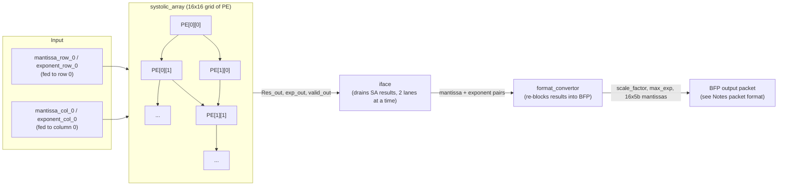
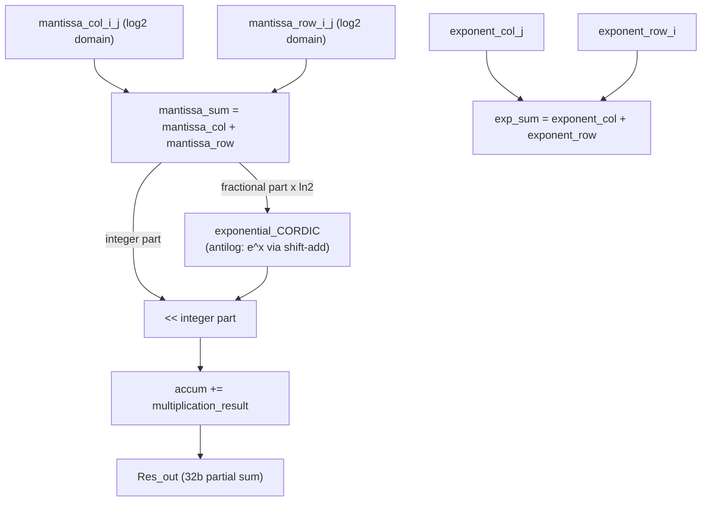

# BFP–LNS Systolic Array Accelerator

A hardware accelerator for matrix multiplication in ML workloads, built around a **systolic array** of processing elements (PEs) that operate on data encoded in **Block Floating Point (BFP)** format, combined with a **Logarithmic Number System (LNS)** multiply scheme inside each PE.

The two ideas work together:

- **BFP** groups nearby values (e.g. a row/column tile) under one shared exponent, so only a handful of narrow mantissas + one exponent need to move through memory/interconnect per block — much cheaper than carrying a full exponent per value (like IEEE-754) while still giving better dynamic range than plain fixed-point.
- **LNS** turns multiplication into addition: instead of a real hardware multiplier per PE, each PE **adds two log-domain mantissas** and converts the sum back to linear domain with a cheap shift-and-add "antilog" circuit. This trades multiplier area for a small ROM/shift-add unit, which is attractive for ASIC area and power.

Together the goal is an array that is both **memory-efficient** (BFP) and **hardware-efficient** (LNS, no true multipliers) for matrix-multiply-heavy ML inference.

> **Status:** this is an active work-in-progress RTL codebase, not yet a verified, tapeout-ready design. Several known issues are documented explicitly below (see [Known Issues](#known-issues-summary)) rather than glossed over, since the intent of this README is to be an honest engineering log as much as a project pitch.

---

## Table of Contents
1. [Architecture Overview](#architecture-overview)
2. [Mathematical Background](#mathematical-background)
3. [File-by-File Documentation](#file-by-file-documentation)
4. [Known Issues Summary](#known-issues-summary)
5. [Design Concerns & Justifications](#design-concerns--justifications)
6. [Roadmap to an ASIC-Ready Design](#roadmap-to-an-asic-ready-design)
7. [Conclusion](#conclusion)

---

## Architecture Overview

### Conceptual data flow

The intended round trip for one value is:

```
linear mantissa (e.g. FP32) ──► log_finder ──► log2(mantissa)
                                                     │
                          shared block exponent + scale_factor
                                                     │
                                     shifter_quantizer (compress to 5-bit)
                                                     │
                                [ BFP packet: header + 4-16 mantissas ]
                                                     │
                                          (memory / interconnect)
                                                     │
                                              descaling (expand back)
                                                     │
                                    16-bit log-domain mantissa ──► PE
```

Inside the array, two log-domain mantissas meeting at a PE are **added** (= multiplying the original linear values), the block exponents are **added** (standard floating-point exponent arithmetic), and the sum is converted back to linear magnitude with the `exponential_CORDIC` antilog unit before being accumulated.

### Current implemented pipeline



**Important architectural note confirmed during development:** `format_convertor` and `iface` currently sit **downstream** of the systolic array — they re-block the array's *own results* (`Res_out`/`exp_out`) back into a compact BFP packet (matching the format sketched in `Notes`), rather than pre-processing the raw input matrices before they enter the array. This makes sense for chaining layers (one layer's output becomes the next layer's BFP-encoded input) or for writing compressed results back to memory. The **input side** of the array (feeding `mantissa_row_0`/`mantissa_col_0`) does not yet have an equivalent BFP-decode stage wired in — see [Known Issues](#known-issues-summary).

### PE internals (one cell)



---

## Mathematical Background

### 1. Block Floating Point (BFP)

For a block of N values sharing exponent range, BFP stores **one exponent per block** plus **N short mantissas**, instead of N full floating-point numbers. A value is reconstructed as `mantissa_i × 2^(shared_exponent + local_scale)`. This project additionally quantizes each block's mantissas to 5 bits and stores one extra `scale_factor` per block (found by `format_convertor`), similar in spirit to microscaling / MX-style formats used in modern ML accelerators.

### 2. Logarithmic Number System (LNS) multiply

Instead of multiplying two magnitudes `m1 × m2` with a real multiplier, LNS stores `log2(m1)` and `log2(m2)` and computes:

```
log2(m1 × m2) = log2(m1) + log2(m2)   → just an adder
m1 × m2       = 2^(log2(m1) + log2(m2))   → needs an "antilog" (2^x) unit
```

So a multiply becomes **one adder + one antilog circuit**. The cost moves from a multiplier to computing `2^x` for a fractional `x`, which is what `exponential_CORDIC` (really an antilog unit, see below) does.

### 3. The antilog unit (`exponential_CORDIC.v`)

Given a log2-domain mantissa sum `S = S_int . S_frac` (fixed-point), we want `2^S = 2^S_int × 2^S_frac`.

- `2^S_int` is just a **left shift** by `S_int` bits.
- `2^S_frac` for `S_frac ∈ [0,1)` is computed via `2^x = e^(x·ln2)`, and the module computes `e^y` for `y = S_frac·ln2` using a **bit-serial, table-driven shift-and-add decomposition**:

  For `y = Σ bᵢ·2⁻ⁱ` (bits of y), since `e^y = Π (e^(2⁻ⁱ))^bᵢ`, each factor `e^(2⁻ⁱ)` is either 1 (bit off) or a constant `Cᵢ = e^(2⁻ⁱ)` (bit on). Each `Cᵢ ≈ 1 + 2⁻ᵏ¹ + 2⁻ᵏ² + 2⁻ᵏ³` is stored as three shift amounts in a lookup table (`e[0..7]`), so multiplying the running accumulator by `Cᵢ` is just `acc + (acc>>k1) + (acc>>k2) + (acc>>k3)`.
  - Bits of `y` are extracted one per cycle via a classic **compare-and-subtract** trick: a `power_of_two` register starts at 0.5 and halves each cycle; if it's ≤ the remaining fraction `z`, that bit is 1, subtract it out.
  - 8 cycles → 8 bits of `y` processed, one shift-add multiply-in per set bit.

  So despite the module's name, this is **not** the classical hyperbolic-CORDIC rotation algorithm (no arctanh angle table, no gain correction `K`). It's a table-driven bit-serial multiplicative decomposition that happens to share CORDIC's "one bit per cycle, shift-and-add only" spirit.

### 4. The log2 approximation (`log_finder` in `submodules_FC.v`)

To go the other direction (linear → log2), the module finds the position of the leading `1` bit (`lead_one_detector`) to get the integer part of `log2`, then uses the next 8 bits after the leading one directly as the fractional part: `log2(1+f) ≈ f`. This is a cheap, fast, but not very accurate approximation (worst-case error ≈0.086 near `f=0.5`) — a common trade-off in log-domain hardware, but worth knowing when reasoning about end-to-end numerical accuracy.

---

## File-by-File Documentation

### `exponential_CORDIC.v`

**Purpose:** Antilog unit — computes `e^x` (used as `2^x` after a `ln2` pre-multiply) for an 8-bit fractional input, over 8 clock cycles, using only shifts and adds.

**Math:** see [Section 3](#3-the-antilog-unit-exponential_cordicv) above.

**Pseudocode:**
```
on reset: z=0, power_of_two=0.5, expx=1.0, state=INIT

INIT:
    if valid_in: latch z = x, go to COMPUTE
    (keep re-priming power_of_two=0.5, expx=1.0 every idle cycle)

COMPUTE (repeats 8x, iteration_counter = 0..7):
    if power_of_two <= z:
        z -= power_of_two
        expx += shift-add correction using e[iteration_counter]
    power_of_two >>= 1
    iteration_counter++
    if iteration_counter == 7: go to OUT

OUT:
    valid_out = 1 for one cycle, exp_result = expx
    go back to INIT
```

**Scope of improvement:**
- **Not pipelined / not streaming-capable.** It ignores `valid_in` while busy (only sampled in `INIT`), so it can accept a new operation only once every ~9 cycles. This is the single biggest throughput bottleneck in the whole design (see [Known Issues](#known-issues-summary)).
- Increase the lookup table depth / add a small correction term for the currently-skipped `2⁻⁸` bit to improve accuracy.
- Rename `rst` → `rst_n` for consistency with the rest of the codebase (it's used as active-low here even though the name doesn't say so).
- Remove or actually use the unused `Int_WIDTH` / `DATA_WIDTH` parameters.
- The signed `expx` register is right-shifted with `>>`, which is a **logical**, not arithmetic, shift in Verilog even on a `signed` register — fine while everything stays non-negative, but will silently misbehave once negative-operand support is added (see Roadmap). Use `>>>` if `expx` can ever go negative.
- No overflow protection on `expx` if a shift-add correction pushes it past the register width.

---

### `PE.v`

**Purpose:** One processing element — the multiply-accumulate cell of the systolic array, implemented as an LNS multiplier (log-add + antilog) feeding an accumulator, plus systolic pass-through registers for row/column data.

**Math:** `exp_sum = exponent_col + exponent_row` (block exponent addition). `mantissa_sum = mantissa_col + mantissa_row` (log-domain "multiply"). The fractional part of `mantissa_sum`, scaled by `ln2`, drives the antilog unit to get `2^(fractional part)`; the integer part of `mantissa_sum` drives a left shift to get `2^(integer part)`; multiplying these reconstructs the linear product of the two original mantissas, which is accumulated into `Res_out`.

**Pseudocode:**
```
exp_sum      = exponent_col_j + exponent_row_i
mantissa_sum = mantissa_col_i_j + mantissa_row_i_j          // 17 bits
frac_ln2     = mantissa_sum[7:0] * ln2   (via shift-add: >>1 + >>3 + >>4 + >>7)
antilog      = exponential_CORDIC(frac_ln2)                  // e^(frac*ln2) = 2^frac
product      = antilog << mantissa_sum[16:8]                 // *2^(integer part)

on anti_log_valid:
    accum += product
    last_out <= last_row_in && last_col_in

every cycle (systolic shift):
    forward mantissa_col_i_j, mantissa_row_i_j, exp_sum to neighboring PEs when valid_in
```

**Scope of improvement / Known issues found:**
- **[BUG] Throughput mismatch:** the systolic dataflow assumes a new valid operand pair can arrive every cycle, but the embedded `exponential_CORDIC` takes ~9 cycles per operation and ignores new inputs while busy. Any data that streams through faster than one operand pair per 9 cycles will be silently dropped/miscounted by the antilog unit. This needs either a fully pipelined (or combinational, unrolled) antilog unit, or an explicit stall/backpressure mechanism between PEs.
- **[BUG-risk] Shift-amount width vs. register width:** `mantissa_sum[16:8]` is a 9-bit field (0–511) used directly as a shift amount on an 11-bit antilog value inside a 32-bit accumulator. Any integer part larger than ~21 will shift all meaningful bits out of the 32-bit `multiplication_result`, silently producing 0 (Verilog truncates shifts on fixed-width vectors without warning). In practice the *valid* range of the integer part should be small and bounded by the operand format, but nothing in the RTL enforces or documents that bound — worth adding an explicit assertion/clamp.
- No sign handling anywhere (`accum`, `mantissa_sum`, `exp_sum` are all unsigned) — ties directly into the requested negative-operand support (see Roadmap).
- `demand_from_mem` is asserted directly from `anti_log_valid`; combined with the systolic_array wiring bug below, this signal currently has multiple drivers per row.
- Consider separating "compute done" from "value forwarded" more explicitly with a proper valid/ready handshake per port, rather than one `valid_in` gating both the datapath shift-register and the MAC trigger.

---

### `systolic_array.v`

**Purpose:** Generates a 16×16 grid of `PE` instances and wires up the classic systolic dataflow: mantissas/exponents flow right along rows and down along columns; `valid`/`last` flags propagate the same way so each PE knows when it has seen a complete row and column.

**Math:** Pure structural wiring — no arithmetic of its own beyond exponent/mantissa pass-through, which is handled inside each `PE`.

**Pseudocode:**
```
for i in 0..15:
    for j in 0..15:
        instantiate PE(i,j) using:
            mantissa/exponent inputs from PE(i-1,j) [column] and PE(i,j-1) [row]
              (or from *_0 boundary inputs if i==0 / j==0)
            valid_in  = valid from left PE AND valid from top PE
            last_in   = OR of last-seen-so-far and boundary last signal
        propagate this PE's outputs to PE(i+1,j) and PE(i,j+1)
    latch "have we seen last_in_row_0[i]" and "last_in_col_0[i]" into sticky regs
```

**Scope of improvement / Known issues found:**
- **[BUG] Multiple drivers on `demand_from_mem[i]`:** every PE in row `i` (all 16 values of `j`) is wired to `.demand_from_mem(demand_from_mem[i])` — i.e. 16 different PE outputs drive the *same* single-bit wire. This is a genuine multi-driver conflict (undefined/contended value in real hardware, simulator-dependent "last write wins" behavior in RTL sim). It should be per-PE (`demand_from_mem[i][j]`) or reduced (e.g. OR/AND-reduced, or only meaningful from the boundary PE that's actually supposed to request new input).
- **[Style/fragility] Reused genvar `i` for two unrelated purposes:** the same loop variable `i` (from the row-generate loop) is used both for row-indexed things (`last_hori[i]`, `set_i_ready[i]`) and for column-indexed boundary assignments (`valid_in_col[0][i]`, `mantissa_col_i_j[0][i]`). This only works because the array happens to be square (16×16); it will silently break the moment the array becomes non-square or the boundary-broadcast logic is refactored. Worth splitting into clearly-named separate loops/genvars.
- Wire arrays are sized `[16:0][16:0]` (17×17) though only 16×16 is used — the extra row/column of wires at the far edge is declared but never read; harmless but worth trimming for clarity.
- No support today for a configurable array size — everything is hardcoded to 16, which the Roadmap addresses (parameterize to 4×4).

---

### `submodules_FC.v`

Small combinational helper modules used by `format_convertor`.

**`shifter`** — parameterizable left/right shifter (`mant << exp` or `mant >> exp`). No issues; trivial and correct.

**`shifter_quantizer`** — scales a mantissa down by `scale_factor` and clamps to a 4-bit magnitude (saturating at 15), with an extra leading `0` bit reserved (currently unused — natural home for a future sign bit; see Roadmap). Correct but currently saturates rather than rounds, which biases quantization error upward for large values — consider rounding instead of truncating/saturating.

**`encoder_32_5`** — a one-hot-to-binary position encoder (32 inputs → 5-bit index), built from OR-reduction trees. Verified bit-group-by-bit-group to be a **correct** one-hot encoder. **Caveat:** it is *not* a general priority encoder — if ever called with more than one bit set, it silently returns the bitwise-OR of the corresponding indices rather than the position of the highest/lowest set bit. Both current call sites (`log_finder`, `format_convertor`'s scale-factor path) pass genuinely one-hot inputs, so this is safe today but should be documented at the module boundary (e.g. an assertion) to avoid future misuse.

**`rev_num` / `lead_one_detector`** — standard "reverse, two's-complement-AND-trick, reverse back" leading-one detector. Correct, but implemented with two full 32-bit bit-reversals, which is more area/logic-level-expensive on ASIC than a direct priority-encoder tree. Flagged for the ASIC area-optimization pass.

**`log_finder`** — computes an approximate `log2` of a linear mantissa (see [Math §4](#4-the-log2-approximation-log_finder-in-submodules_fcv)). **[Edge-case bug]** if `shifted_mant` is exactly 0 (a genuinely zero value, or a value shifted out of range by a very large exponent difference), the leading-one detector returns all zeros, and the module returns `log_mant = 0` — silently treating a zero magnitude as if it had `log2 = 0` (i.e. magnitude 1). This will corrupt any downstream max/scale-factor computation that includes a true zero element. Needs an explicit zero/denormal special case.

**`round_2_power`** — rounds a value to the nearest power of two by inspecting only the single next-most-significant bit below the leading one, not the full remaining mantissa. This is a fast approximation, not a mathematically exact "nearest power of two" — worth documenting as such, and revisiting if scale-factor accuracy turns out to matter.

**`descaling`** — reconstructs a wider log-domain mantissa from a quantized 5-bit BFP mantissa + a 4-bit scale factor via a left shift. **Currently dead code** — not instantiated anywhere in `top_module.v` (only present as a commented-out placeholder). This is the missing piece needed to feed BFP-compressed data back into the array's mantissa ports (see [Known Issues](#known-issues-summary)).

---

### `format_convertor.v`

**Purpose:** Consumes a stream of exponent pairs followed by a stream of (log-domain) mantissa pairs, and produces one BFP-encoded block: a shared `max_exp`, a `scale_factor`, and 16 quantized 5-bit mantissas.

**Math:** `max_exp = max` over all exponents in the block (standard BFP exponent alignment). Each mantissa is first shifted right by `max_exp − its own exponent` (aligning it to the shared exponent, via `shifter` + `log_finder`), the resulting log-domain values are tracked for their own max (`max_mant_int`), which is divided by 15 and rounded to the nearest power of two to become `scale_factor` — i.e., the scale factor is chosen so that the largest mantissa in the block just fits into the 4-bit (0–15) quantized range.

**Pseudocode:**
```
state = CALC_MAX_EXP
CALC_MAX_EXP:
    on each exp_valid pair (exp0, exp1): max_exp_int = max(max_exp_int, exp0, exp1)
    when last_exp_sent: max_exp_calculated = 1; state = FIND_SCALE_FACTOR

FIND_SCALE_FACTOR:
    on each mantissa_valid pair (mant0, mant1):
        shift each by (max_exp - its exponent), take log2 of the shifted value
        max_mant_int = max(max_mant_int, log_mant0, log_mant1)
        store both into mant_block[] (16 slots total, filled 2/cycle over 8 cycles)
    when all_mantissas_sent:
        scale_factor = round_to_pow2(max_mant_int / 15), as a 5-bit index
        quantize all 16 stored mant_block[] entries by scale_factor → mantissa_out
        block_ready = 1 (one-cycle pulse)
        state = CALC_MAX_EXP
```

**Scope of improvement / Known issues found:**
- **[Inefficiency]** Exponents are transmitted **twice** — once during `CALC_MAX_EXP` (to find `max_exp`) and again during `FIND_SCALE_FACTOR` (paired with each mantissa, to compute its shift). Since `iface` sends the exact same 16 exponents both times, this doubles the number of cycles needed per block for no new information. A single-pass design (buffer exponents once, or use a running-max architecture) would roughly halve the per-block latency.
- Declarations (`mant_block`, `log_mant0/1`) appear in the file *after* first use — legal Verilog (declarations aren't order-sensitive at module scope) but hurts readability; consider moving all declarations to the top of the module.
- `idx` is declared 4 bits wide but only ever needs 3 bits (values 0–7).
- No handling for a block with fewer than 16 valid rows (needed for smaller/edge tiles once variable matrix sizes are supported — see Roadmap).
- `shift_exp0`/`shift_exp1` (`max_exp - exp_m_1/2`) has no underflow guard; should never go negative if `max_exp` truly is the max, but there's no assertion guarding that invariant if upstream data is ever malformed.

---

### `iface.v`

**Purpose:** A simple FSM that drains the systolic array's per-column results (`Res_out`, `exp_out`, `valid_out`) two rows at a time, first sending all 16 exponents (for `format_convertor`'s max-exponent pass), then all 16 (mantissa, exponent) pairs (for its scale/quantize pass).

**Math:** none — pure sequencing/control logic.

**Pseudocode:**
```
state = WAIT_FOR_START
WAIT_FOR_START:
    on start: state = SEND_EXPONENTS

SEND_EXPONENTS:
    while both valid_column[row_idx][col] and valid_column[row_idx+1][col]:
        emit (exponent[row_idx][col], exponent[row_idx+1][col]), valid=1
        row_idx += 2
    when max_exp_calculated: state = SEND_MANTISSAS, reset row_idx

SEND_MANTISSAS:
    each cycle: emit (mantissa[row_idx][col], mantissa[row_idx+1][col]) and
                (exponent[row_idx][col], exponent[row_idx+1][col]), valid=1
    row_idx += 2
    when mantissas_sent_out: col_idx += 1, reset row_idx, state = WAIT_FOR_START
```

**Scope of improvement / Known issues found:**
- No timeout/error handling if the expected `valid_column` bits never arrive for a given row pair — the FSM will simply stall forever in `SEND_EXPONENTS`. Fine for a controlled testbench, risky for a real system; worth adding a watchdog or explicit error output.
- No top-level "all 16 columns fully drained" signal is exposed — only per-column completion (`mantissas_sent_out`) is visible; `top_module` has to infer overall progress indirectly via `block_cnt`.
- The two-phase (exponents-then-mantissas) sequencing here is exactly what drives the double-transmission inefficiency noted in `format_convertor.v` above — fixing one likely means redesigning the other in tandem.
- Row indexing assumes exactly 16 rows; will need generalizing once the array size/dimension becomes configurable (Roadmap item).

---

### `top_module.v`

**Purpose:** Top-level integration — wires `systolic_array` → `iface` → `format_convertor`, and contains the (currently fairly ad hoc) logic that decides when to kick off a new `iface` drain pass.

**Math:** none directly; it's glue logic.

**Pseudocode:**
```
SA = systolic_array(...)
start_op = (valid_out[0][1] ? block_ready : valid_out[0][0]) && (block_cnt != 15)
on block_ready: block_cnt = (block_cnt == 15) ? 0 : block_cnt + 1
iface(start = start_op, valid_column = SA.valid_out, mantissa = SA.Res_out, exponent = SA.exp_out, ...)
format_convertor(inputs from iface outputs, ...)
```

**Scope of improvement / Known issues found:**
- **[Fragile control logic]** `start_op`'s definition — branching on `valid_out[0][1]` to decide whether to gate on `block_ready` vs. `valid_out[0][0]` — is a hand-tuned heuristic tied to this specific array size and startup sequence. It's hard to reason about and will not generalize to a configurable array size. This is exactly the gap the requested **controller module** should fill (see Roadmap).
- Several commented-out blocks (block-storing register banks, descalers) show work-in-progress toward the register-bank architecture described in the Roadmap — worth keeping as a design note/TODO comment rather than dead commented code, or moving into a tracked issue.
- `block_cnt` and other regs are declared/used before their textual declaration further down the file — legal but hurts readability; consider reordering.
- **[Missing link]** There is currently no BFP-decode / `descaling` stage wired between "data at rest" (BFP-encoded blocks) and the array's `mantissa_col_0`/`mantissa_row_0` inputs — the array currently expects to be fed log-domain mantissas directly. This needs to be closed for the full pipeline (BFP storage → array → BFP storage) to actually work end-to-end.

---

### `tb_TOP_1.v`

**Purpose:** Testbench that drives two 16×16 matrices `A`, `B` into the array's boundary inputs one row/column at a time (paced by `set_i_ready`), and dumps `Res_out` to `res.txt`.

**Scope of improvement / Known issues found:**
- **[Critical, for interpreting simulation results]** The testbench feeds `A`/`B`'s **raw linear values (1–16)** directly into `mantissa_row_0`/`mantissa_col_0`. But `PE` treats its mantissa inputs as **already being in log2 domain** (it *adds* them to multiply). Feeding raw linear integers therefore does **not** exercise the intended `log_finder → quantize → descale` pipeline, and the resulting `Res_out` values will not equal `A × B`. To validate the design end-to-end, the testbench needs to either (a) pre-compute `log2(A[i][j])`/`log2(B[i][j])` in the stimulus, or (b) be extended to drive raw values through `log_finder`/`descaling` first, exactly mirroring what the real datapath is supposed to do.
- `exponent_col_0`/`exponent_row_0` are hardcoded to constants (`8'h01`, `8'h02`) rather than derived from any real per-element exponent — fine for a first smoke test, but means the exponent-arithmetic path is barely exercised.
- `integer i, j;` is declared **after** it's used inside the `initial` block that populates `A`/`B` — legal in Verilog (module-scope declarations aren't position-sensitive) but confusing to read; move to the top of the module.
- `$dumpvars(0, tb_TOP);` references a module name `tb_TOP` that doesn't exist — the module is named `tb_TOP_1`. This line will likely cause a compile/elaboration error or simply dump nothing, depending on simulator. Needs a fix to `tb_TOP_1`.
- The fixed `#100000` delay before checking/printing results is a magic number tied to the current (slow, non-pipelined) antilog throughput; once the pipeline mismatch is fixed this will need to be replaced with a proper "all results valid" check instead of a fixed wait.
- No self-checking / scoreboard — results are only dumped to a file for manual inspection, not compared against an expected `A×B` reference. A proper testbench should compute the expected product in a behavioral model and automatically PASS/FAIL.

---

### `Notes`

Documents a candidate BFP packet layout:

```
HEADER : tile_row_idx, tile_col_idx, output_row_idx, block_exponent (8b), scale_factor (4b)
PAYLOAD: mantissa_0..mantissa_3 (5b each)
```

This is a reasonable, compact packet format for a 4-wide block, and lines up with the direction of the Roadmap (4-element blocks fitting in a 32-bit register). Worth formalizing this as an actual header `struct`/`typedef` shared between the RTL and any future software driver, so the two never drift apart.

---

## Known Issues Summary

| # | File | Issue | Severity |
|---|------|-------|----------|
| 1 | `PE.v` / `exponential_CORDIC.v` | Antilog unit is not pipelined; systolic dataflow assumes streaming input every cycle — real throughput mismatch | High |
| 2 | `systolic_array.v` | `demand_from_mem[i]` driven by all 16 PEs in row `i` — multi-driver conflict | High |
| 3 | `tb_TOP_1.v` | Testbench feeds raw linear values where log-domain mantissas are expected — results won't equal `A×B` as-is | High |
| 4 | `top_module.v` | No `descaling` stage wired between BFP storage and array inputs — pipeline is not closed end-to-end | High |
| 5 | `submodules_FC.v` (`log_finder`) | Zero-value mantissa silently treated as `log2 = 0` | Medium |
| 6 | `format_convertor.v` / `iface.v` | Exponents transmitted twice per block (two full passes) | Medium |
| 7 | `PE.v` | 9-bit shift-amount field vs. 32-bit accumulator — large integer parts could silently truncate to 0 | Medium |
| 8 | `top_module.v` | `start_op` logic is a hand-tuned, array-size-specific heuristic | Medium |
| 9 | `tb_TOP_1.v` | `$dumpvars(0, tb_TOP)` references a non-existent module name | Low (fix is trivial) |
| 10 | `systolic_array.v` | Genvar `i` reused for two unrelated (row vs. column) purposes; only works because array is square | Low |
| 11 | `exponential_CORDIC.v` | Unused `Int_WIDTH`/`DATA_WIDTH` parameters; `rst` named as if active-high but used active-low | Low |

---

## Design Concerns & Justifications

This section documents open design questions that came up during development, along with the reasoning for why the current approach is (or isn't) justified. Recording these here rather than only resolving them in conversation, so the reasoning survives and can be revisited later.

### Concern 1: Is BFP even worth it, if the host only speaks FP?

**The concern, stated plainly:** The CPU/host driving this accelerator stores and produces tensors in FP (FP32/FP16/BF16). It cannot natively "send a BFP block" — so doesn't that mean:

1. The driver/host has to convert FP → BFP before sending data in,
2. the chip has to decode BFP back into something it can compute with,
3. compute happens,
4. the chip has to re-encode results back into BFP for storage/forwarding,
5. and finally the host needs the answer back in FP, requiring one more conversion —

and if there are *that* many conversions surrounding the compute, is the BFP compression actually saving anything, or just adding overhead around a computation that ends up FP-in, FP-out anyway?

**Resolution: yes, it's worth it — but only because of *where* each conversion happens and *how many times each converted value gets reused* before the next conversion. Compression ratio alone doesn't justify the scheme; reuse does.**

**1. A software driver absolutely can send BFP blocks — this isn't a hardware limitation.**
The FP → BFP encode (Algorithm 1 in the reference format: find block max exponent, align mantissas, log-transform, quantize) can run entirely as a **host-side software step**, before any data crosses the PCIe/interconnect boundary into the accelerator's memory. The CPU already has the tensor in FP in its own memory; nothing requires it to ship raw FP32 bit patterns to the device. This is exactly what the accelerator architectures this project follows assume: the encode/decode procedure is described independent of *where* it runs, and running it on the host (or a small dedicated front-end) means **the expensive on-chip/DRAM traffic never has to carry full FP width in the first place.**

**2. The real question isn't "how many conversion steps exist" — it's "how many times is each converted value reused before it's converted again."**
A systolic array's entire purpose is data reuse: one operand sits in a PE and streams against many other operands before it's ever discarded. That reuse is what amortizes the one-time cost of getting a value into BFP:

| Step | Where it happens | Frequency relative to compute |
|---|---|---|
| FP → BFP (weights) | once, at load time (driver or front-end) | paid once per weight; that weight is then reused across every activation it multiplies against in the array — tens to thousands of reuses |
| FP → BFP (input activations) | once, at input time | paid once per input; reused across every output it contributes to |
| BFP flowing SA → drain logic → re-block → next layer | entirely on-chip | this is the **high-volume, repeated traffic** BFP is actually optimizing — it should never touch FP at all |
| Descaling (BFP → wider log-domain fixed-point, inside the PE datapath) | once per operand, per pass through a PE | *not* an FP conversion — it only undoes the 5-bit quantization/scale-factor compression; the value stays in log-domain fixed-point the whole time |
| BFP → FP (final output) | once, at the very last layer, before handing back to the host | small: the final output tensor is typically orders of magnitude smaller than the weights/activations that produced it |

So the FP boundary conversions are **one-time costs at the edges of the pipeline**, while the value they produce gets reused many times *inside* the pipeline without ever paying the FP tax again. The "convert → compute → convert back" pattern is real, but it happens once per value at the chip's I/O boundary, not once per operation inside the array.

**3. Where this justification would actually break down (worth watching for):**
- **Low data reuse.** If a workload uses every value in exactly one multiply and then discards it, there's nothing to amortize the conversion cost over, and plain FP16/BF16 could beat BFP+conversion overhead outright. The benefit scales with reuse factor, not just with compression ratio.
- **Converting back to FP between every layer.** If intermediate layer outputs are decoded to full FP and re-encoded on every layer boundary (e.g. an unnecessary host round-trip per layer, or an on-chip decode/re-encode that isn't actually needed), the conversion cost gets paid every layer instead of once — this would erase most of the benefit. **This is why it matters that intermediate results stay in BFP end-to-end on-chip** (confirmed data flow: systolic array → drain/iface → format_convertor → next layer's input, never touching FP in between).
- **Large output tensors.** If the workload's final output is *not* small relative to its weights/activations (unlike, say, classification logits or an embedding vector), the one-time output decode stops being negligible and should be budgeted more carefully.

**Conclusion for this project:** the design is justified specifically because it targets a **reuse-heavy accelerator** (a systolic array, whose entire architectural point is operand reuse) where FP only has to exist at the two edges of the pipeline — decode once on the way in, encode once on the way out — while all the expensive, repeated inter-layer and on-chip traffic in between stays compressed the whole time. The action item this implies for the RTL: make sure the "keep in BFP vs. decode to FP" decision is an explicit control-plane choice (owned by the controller), not something that happens implicitly or too often, so the reuse argument above actually holds in practice and doesn't quietly degrade into per-layer FP round-trips.

---

## Roadmap to an ASIC-Ready Design

Based on where the RTL is today and the direction discussed for the next iteration, here's a concrete plan to get from "functionally-sketched systolic array" to "ASIC-ready accelerator":

### 1. Parameterize and right-size the array
- Convert all array-size-dependent code (`systolic_array`, `iface`, `format_convertor`, `top_module`) to use a `parameter ARRAY_DIM` instead of hardcoded `16`, and fix the genvar-reuse fragility noted above so row/column indexing is independent.
- Move the working array size down to **4×4** as the near-term target. A smaller array is far easier to verify exhaustively, close timing on, and floorplan, and is a more realistic first ASIC tile — it can always be replicated/tiled at the system level later.

### 2. Register-bank front end at the array edges
The plan to place small register banks along the row/column edges of the array is a good fit for the BFP packet format already sketched in `Notes`: a 4-element block (4×5-bit mantissas = 20 bits, easily fits with header bits in a 32-bit word) can be loaded into a 32-bit register in one cycle, and with 8 registers (4 rows + 4 columns) filled over 4 cycles, the first PE (`PE[0][0]`) has enough time to start computing before the rest of the array is even loaded — effectively hiding load latency behind the first few cycles of compute. Concretely:
- One register per row and one per column at the array boundary, each holding one packed BFP block (shared exponent + scale factor + 4 mantissas).
- A small **descaling** stage (already written, just needs to be wired in) sits between each register and the array's row/column input, expanding the packed 5-bit mantissa back into the log-domain width the PE expects.
- Because loading is decoupled from compute (registers fill while `PE[0][0]` and its neighbors are already crunching), this should hide most of the load latency behind useful work — worth confirming with a cycle-accurate model before committing to layout.

### 3. A dedicated controller
Replace the current hand-tuned `start_op` heuristic in `top_module` with a real controller FSM responsible for:
- Sequencing register-bank loads → array compute → result drain, for one tile.
- Accepting a **matrix-dimension configuration** (`M`, `N`, and the shared inner dimension `K`) so matrices smaller than the physical array size can run without wasting the unused rows/columns — e.g. by masking `valid_in` for unused PEs and detecting completion at PE `[M-1][N-1]` instead of the array's fixed corner.
- For matrices *larger* than the array, exposing a simple tile-request/tile-done handshake so an external **software driver** can stream tiles in sequence (the driver owns tiling/blocking strategy; the controller just needs to make "load next tile, start, tell me when the corner PE is done" a clean interface).
- Owning the drain sequencing that `iface` currently does mostly independently, so exponent/mantissa retransmission (Known Issue #6) can be eliminated by having the controller buffer exponents once and reuse them.

### 4. Negative operand support
Currently everything (mantissas, exponents, accumulator) is unsigned magnitude only. To support signed values:
- Add an explicit sign bit per mantissa (there's already a spare leading bit reserved in `shifter_quantizer`'s 5-bit output — natural place to carry it).
- Propagate sign through the systolic array alongside the log-domain magnitude, XOR-ing row/column signs at each PE to get the product's sign (standard sign-magnitude multiply).
- Make the accumulator (`accum` in `PE.v`) a true signed adder/subtractor based on that sign, and switch any `expx >> shift` in the antilog unit to `>>>` once the value it operates on can be negative (it can't today, but will need to remain non-negative internally even with signed magnitudes at the PE level — worth double-checking the boundary carefully here).

### 5. Fix the pipeline-breaking bugs before anything else
Before optimizing area/timing further, the High-severity items in the [Known Issues](#known-issues-summary) table should be resolved first, since they affect correctness, not just efficiency:
- Pipeline (or fully unroll/combinationalize) the antilog unit so it can accept one operation per cycle, matching the systolic dataflow's assumption.
- Fix the `demand_from_mem` multi-driver wiring.
- Wire in `descaling` so the BFP round trip is actually closed end-to-end.
- Build a self-checking testbench with a behavioral reference model (plain floating-point `A×B` in a testbench task) that the RTL output is automatically compared against, replacing the current "dump to file and eyeball it" approach.

### 6. Reduce redundant signals
Once the controller exists, several currently-separate handshake signals (`valid_in_row`/`valid_in_col`, `last_in_row`/`last_in_col`, `demand_from_mem`, `set_i_ready`) can likely be consolidated into a smaller, more uniform valid/ready + tile-boundary protocol, reducing both wiring congestion and the number of distinct FSMs that need to agree with each other.

### 7. Verification and ASIC-readiness pass
- Add assertions for the invariants currently only implicit in the RTL (e.g. `max_exp` really is the max of all block exponents; shift amounts never exceed register width; `encoder_32_5` is only ever given one-hot inputs).
- Characterize numerical accuracy end-to-end (log2 approximation error × antilog approximation error × quantization error) against a floating-point golden model, across a realistic range of ML activation/weight distributions, to know the real-world error budget before committing to a specific mantissa/exponent width for tapeout.
- Once functionally clean, run through standard ASIC-readiness gates: lint (no multi-driver nets, no combinational loops, consistent reset polarity/style throughout — note the `rst` vs `rst_n` naming inconsistency should be resolved everywhere), CDC review (if register banks end up on a different clock domain than the array), and synthesis-level area/timing exploration on the 4×4 array before scaling back up.

---

## Conclusion

The core idea here — BFP for cheap memory movement, combined with an LNS-based multiply-free PE for cheap compute — is a genuinely interesting and hardware-efficient combination for an ML systolic accelerator, and the pieces needed for it (log2 approximation, antilog approximation, block exponent/scale-factor extraction, systolic dataflow) are all present in some form in this codebase. What's missing to call it a working, end-to-end system is mainly **connecting the pieces that already exist** (wiring `descaling` in, fixing the antilog unit's throughput so it matches the systolic assumption, closing the loop with a real self-checking testbench) rather than inventing new algorithms. The planned next iteration — a parameterized, smaller (4×4) array with register-bank front ends, a real controller, dimension-aware operation, and signed operand support — is a sensible and achievable path from "functionally-sketched RTL" to an ASIC-ready design, provided the high-severity correctness issues above are resolved first so that later optimization work is being done on a foundation that's actually known to compute the right answer.
